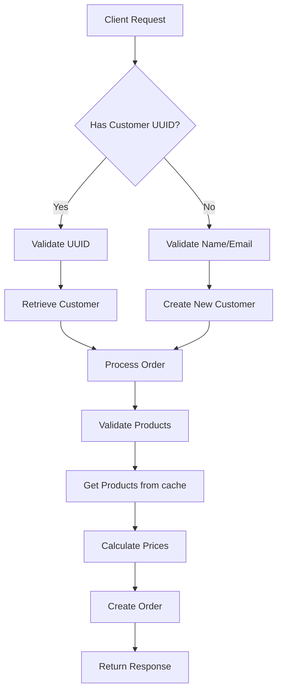

##  Installation

```bash
git clone https://github.com/Abdukhaligov/test-app
cd test-app
```

```bash
composer install
```

```bash
php artisan migrate --seed
```

```bash
docker compose up
```

##  Features

- **Customer Management**:
    - Create customers by UUID or email/name combination
    - Automatic duplicate prevention
    - UUID primary keys

- **Product System**:
    - Price change tracking
    - Batch caching with Redis
    - Automatic cache invalidation

- **Order Processing**:
    - Transaction-safe order creation
    - Flexible customer identification
    - Automatic total price calculation
    - Relationship-based product management

## API Endpoints
| Method | Endpoint         | Description            |
| ------ | ---------------- | ---------------------- |
| GET    | `/orders/{uuid}` | Retrieve order by UUID |
| POST   | `/orders`        | Create a new order     |

## Order Request Handling

The API supports two types of customer identification when creating orders:

### 1. New Customer Order

**Request Format:**
```json
{
    "customer_name": "Smeaar",
    "customer_email": "somaace@emaidl.com",
    "products": [
        {
            "quantity": 91,
            "product_id": 1
        },
        {
            "quantity": 4,
            "product_id": 2
        }
    ]
}
```

**Processing Flow:**
1. ✅ Customer Validation
    - Validate email format
    - Ensure that the name/email combination does not already exist. If it does, retrieve the existing record from the database using the email. The name provided in the request will be ignored, and the name from the database will be returned in the response.
2. 🆕 Customer Creation
    - Generate UUIDv4 for new customer
    - Store in database:
3. 📦 Order Processing
    - Validate product availability
    - Calculate prices using cached product data
    - Create order record with customer relationship
---

### 2. Existing Customer Order

**Request Format:**
```json
{
    "customer_uuid": "fa0ac9f2-8f73-3124-84cb-5f6e1714dfc5",
    "products": [
        {
            "quantity": 91,
            "product_id": 1
        },
        {
            "quantity": 4,
            "product_id": 2
        }
    ]
}
```

**Processing Flow:**
1. 🔍 Customer Verification
    - Validate UUID format
    - Check customer existence in database
2. 🛒 Order Processing
    - Skip customer creation step
    - Use existing customer details
    - Validate products and quantities
    - Calculate total price

---

## Unified Response Format

**Successful Response:**
```json
{
    "id": "a1b2c3d4-e5f6-7g8h-9i0j-k1l2m3n4o5p6",
    "customer_name": "Smeaar",
    "customer_email": "somaace@emaidl.com",
    "total_price": 256.89,
    "items": [
        {
            "product_id": 1,
            "product_name": "Premium Widget",
            "quantity": 91,
            "unit_price": 2.49
        },
        {
            "product_id": 2,
            "product_name": "Deluxe Gadget",
            "quantity": 4,
            "unit_price": 8.25
        }
    ]
}
```

---

## Error Handling

### Common Error Scenarios

**1. Invalid Customer UUID**
```json
{
    "message": "Validation error",
    "errors": {
        "customer_uuid": ["The selected customer uuid is invalid."]
    }
}
```

**2. Missing Required Fields**
```json
{
    "message": "Validation error",
    "errors": {
        "customer_name": ["Required when using new customer"],
        "customer_email": ["Must be valid email address"]
    }
}
```

**3. Invalid Product ID**
```json
{
    "message": "Validation error",
    "errors": {
        "products.0.product_id": ["Invalid product id: 999"]
    }
}
```

**4. Insufficient Quantity**
```json
{
    "message": "Validation error",
    "errors": {
        "products.1.quantity": ["Minimum quantity is 1"]
    }
}
```

---

## Validation Rules

| Field | Rules |
|-------|-------|
| `customer_uuid` | UUIDv4 format, exists in customers table |
| `customer_name` | Required without UUID, 2-255 characters |
| `customer_email` | Required without UUID, valid email format |
| `products` | Array with 1+ items |
| `products.*.product_id` | Valid product ID exists |
| `products.*.quantity` | Integer between 1-999 |

---

## Data Flow Diagram

